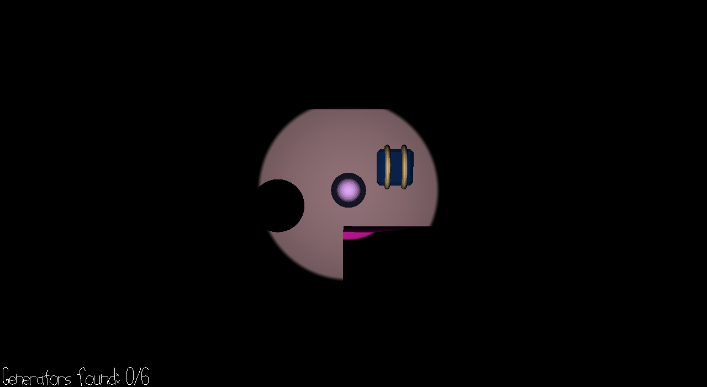

# Turn on the lights!

Author: Jiwoo Yoo

Design: You're trapped in a dark maze, and all you want to do is turn on the lights.
But there's some one else in the maze too, and they don't want the lights on. Find
all the generators before they get you. Luckily, neither they nor the generators are
very quiet...

Screen Shot:

How To Play:
Use wasd to move
Spacebar to sprint. If you're tired, you may want to stop sprinting for a bit

Sources: 
Wind chimes sound effect by minian89 from https://freesound.org/s/217800/

Generator sound effect by cognito perceptu from https://freesound.org/s/323136/

Damage sound effect 1 by funkymuskrat from https://freesound.org/s/37409/

Damage sound effect 2 by stickman from https://freesound.org/s/39294/

Got item sound effect by GameAudio from https://freesound.org/s/220207/

Tired sound effect recorded by my friend Sarah Jang at CMU (thanks Sarah!)

All models by me

This game was built with [NEST](NEST.md).

